# Desktop Google Drive Sync Utility

## A robust, multithreaded Python utility designed to recursively sync large Google Drive folders to a local machine. It safely bypasses the Google Drive web interface file size/count limitations by streaming files directly via the Google Drive API.

This project is built as a result of facing some download error while downloading an entire Google drive folder with more than 500 photos. The project has the following features:

1. Multithreaded Downloader: Downloads up to 10 files simultaneously with adaptive thread throttling.
2. Failsafe Backoff: Automatically handles rate limits (403 Forbidden) by lowering worker counts and utilizing exponential backoff.
3. MD5 Checksum Verification (to be added): Ensures 100% data integrity by checking files against Google Drive's MD5 hashes to skip matches or overwrite corrupted/partial downloads.
4. Persistent Authentication: Caches tokens locally to bypass browser re-authentication on subsequent runs.
5. Dynamic Local Input: Accepts custom folder IDs and local destination paths at runtime.

## How to install this project

1. Clone this project.
2. Technical Prerequisites:
   Ensure your local environment has Python installed:
   1. Python 3.8 or higher
   2. pip (Python package manager)
3. Google Cloud Console & API Setup
   To connect the script to Google Drive, you must register a desktop application on the Google Cloud Platform (GCP) to generate a client secrets configuration.

   1. Create a Google Cloud Project
      1. Open the Google Cloud Console.

      2. Sign in with your personal Gmail account.

      3. Click the project dropdown menu in the top-left corner (next to the "Google Cloud" logo) and select New Project.

        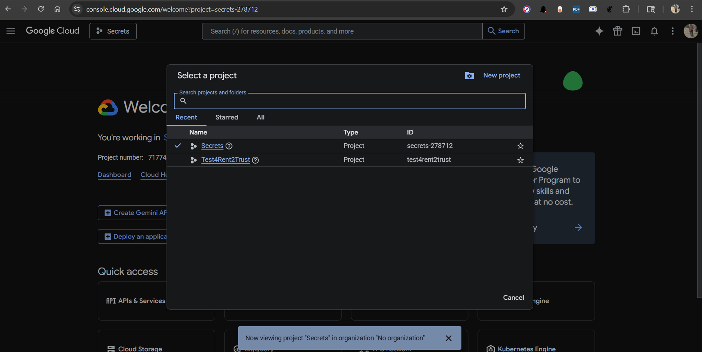

      4. Name the project (e.g., Desktop Gdrive Sync) and click Create. Ensure this new project is  selected in the top-left dropdown before moving to the next step.
        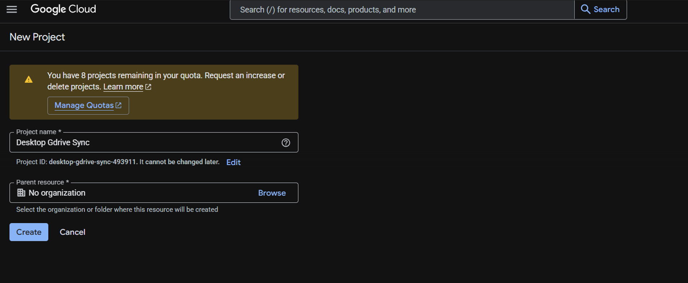

    2. Enable the Google Drive API
        1. Use the top search bar to search for Google Drive API.
            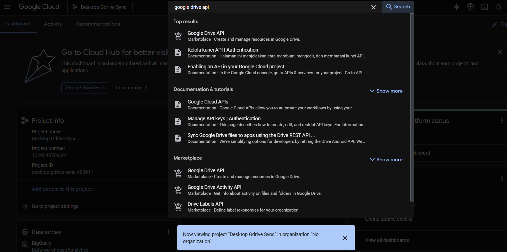

        2. Click on the API from the results list and click the blue Enable button.
            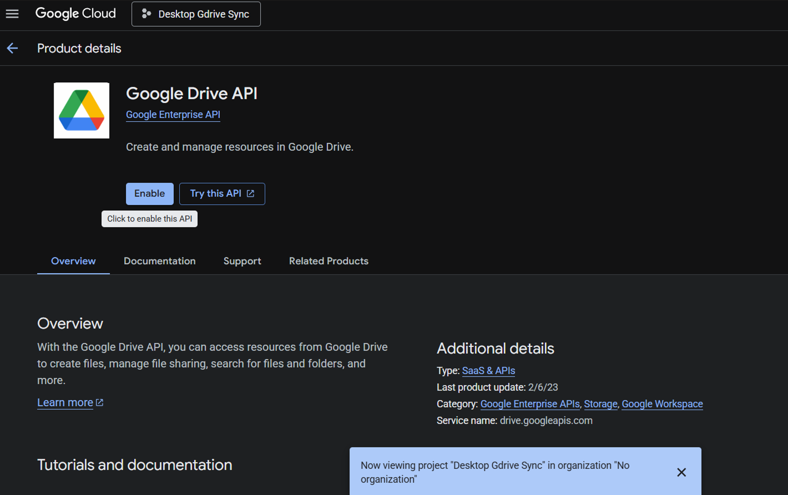  

    3. Configure the OAuth Consent Screen
        1. Because you are using a personal Gmail account (not a Google Workspace account), your app   must be configured as an External testing application:
            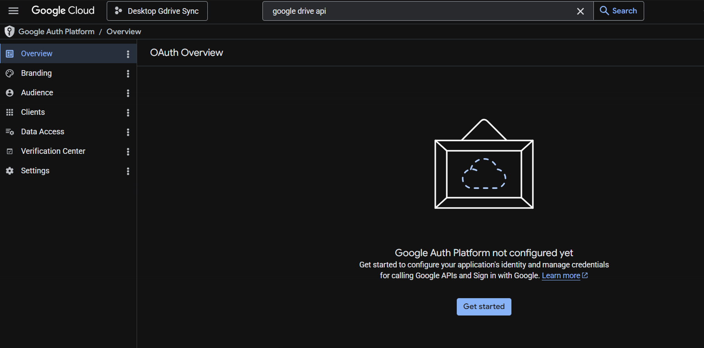

        2. Navigate to APIs & Services > OAuth consent screen via the left-hand sidebar.
            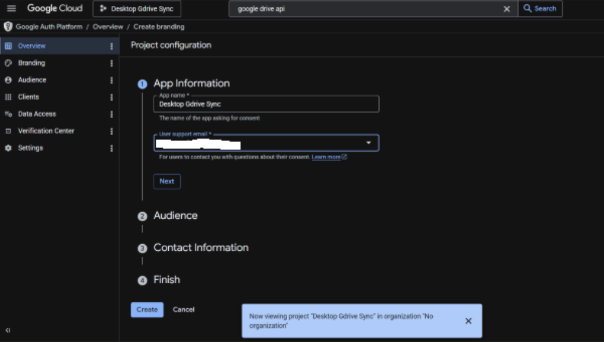

        3. Select External as the User Type and click Create.
            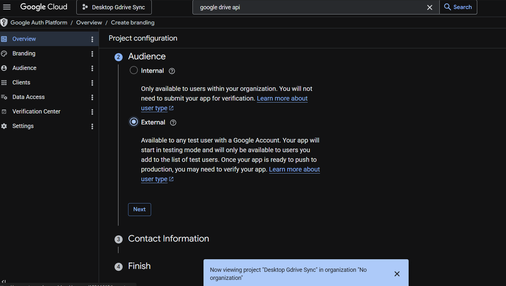

        4. App Information: Fill in the mandatory fields:

            1. App name: Desktop Gdrive Sync

            2. User support email: Select your Gmail address from the dropdown.

            3. Developer contact information: Enter your Gmail address.
                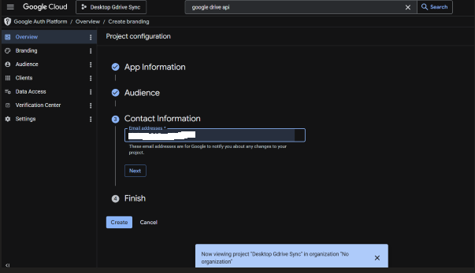

            4. Click Save and Continue.
                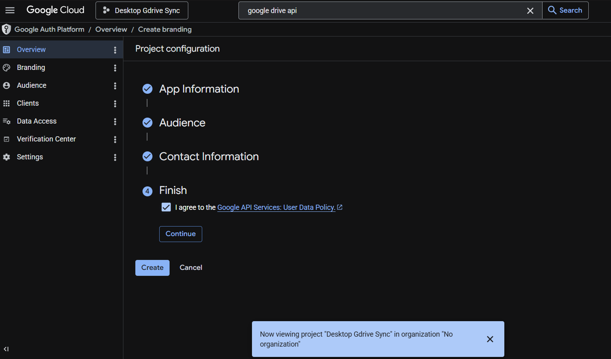
                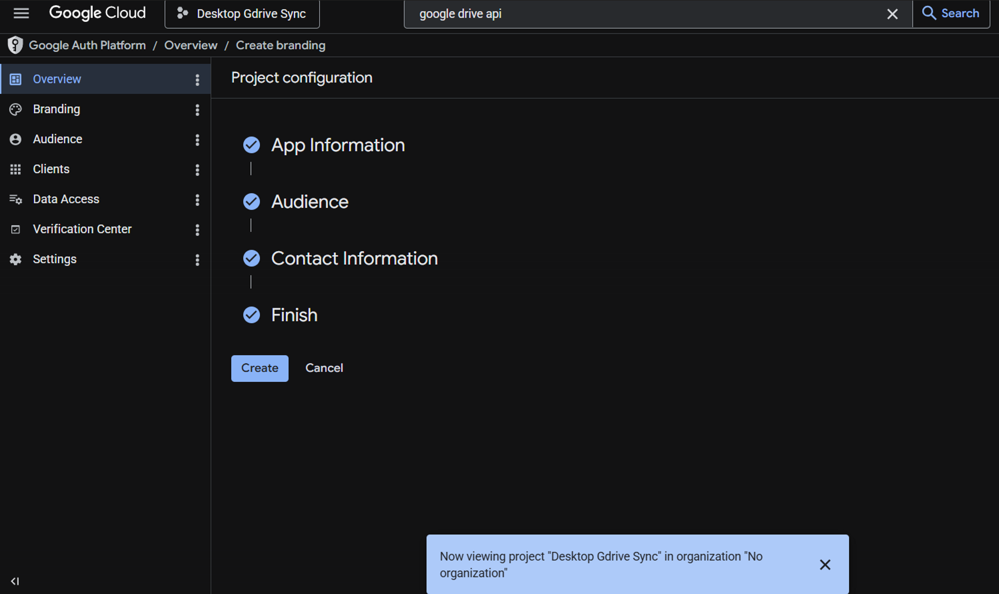

            5. Scopes: Do not modify anything here. Scroll to the bottom and click Save and Continue.

            6. Test Users: Because your app configuration is unverified, Google blocks all logins unless the accounts are explicitly added to the guest list:

                1. Click + Add Users.

                2. Enter your exact Gmail address.

                3. Click Add, then click Save and Continue.
                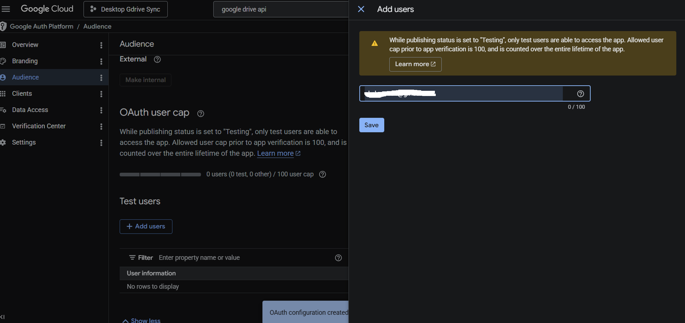

            7. Review the summary dashboard and click Back to Dashboard.

    4. Generate Desktop App Client Credentials
       1. On the left-hand sidebar, click on Clients (or Credentials depending on your console   configuration view).

       2. Click + Create Client (or Create Credentials > OAuth client ID) at the top of the window.
          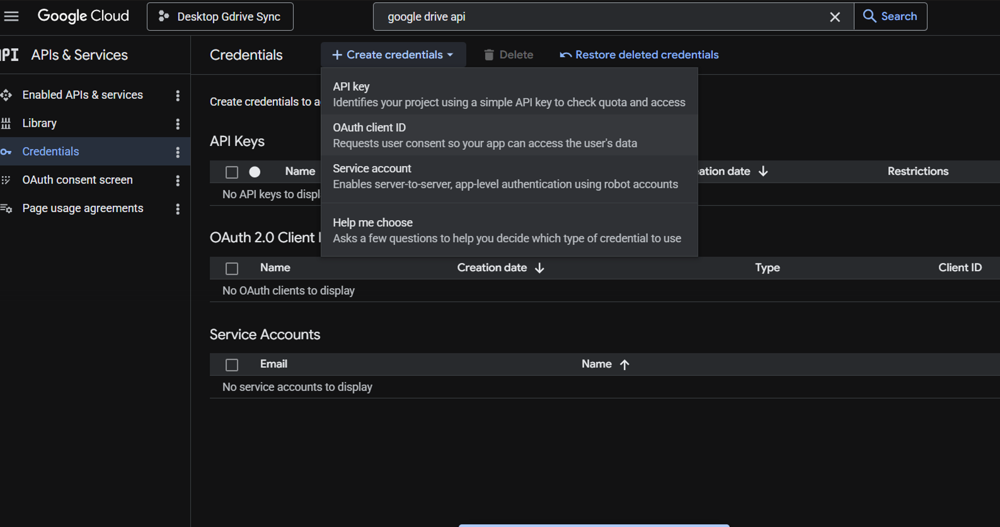

       3. Set the Application type dropdown to Desktop App.

       4. Name the client configuration (e.g., Sync-Script-Desktop) and click Create.

       5. A confirmation dialog will pop up. Click Download JSON to save the credential configuration file.
          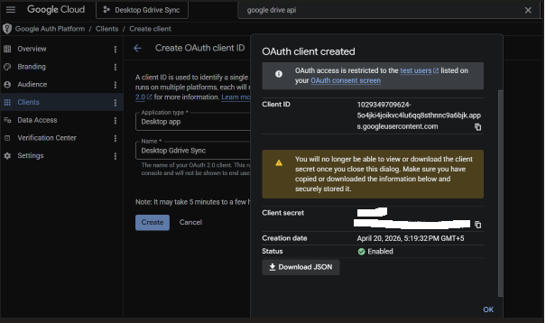

       6. Locate the downloaded file on your computer, rename it to exactly client_secrets.json, and move it to your project folder where your Python script lives.

4. Local Project Setup
   1. Clone or structure your directory: Ensure your project folder contains your script (e.g., Gdrive sync.py) and the credentials file in the same root level:

    ```text
        Desktop-Google-drive-sync/
        ├── client_secrets.json
        └── Gdrive sync.py
    ```
   
   2. Initialize a Virtual Environment (Recommended):

      ```bash
       python -m venv venv

       # On Windows:
       .\venv\Scripts\activate

       # On Linux/macOS:
       source venv/bin/activate
      ```

   3. Install Dependencies:
      Install the required PyDrive2 client wrapper package:

       ```bash
        pip install PyDrive2
       ```

5. Script Execution Guide
    1. Run the utility from your terminal or command prompt:

    ```bash
        python Gdrive sync.py
    ```
    2. Initial Authentication (First Run Only):

        1. A browser tab will automatically open asking you to sign in with your Google Account.

        2. Choose the exact Gmail account you added under the Test Users section in Step 2.

        3. A warning screen saying "Google hasn't verified this app" will appear. This is normal for development applications. Click Advanced, then click Go to Desktop Gdrive Sync (unsafe), and grant permissions.

        4. Once completed, you can close the browser tab. The script will save an authentication state token file named my_login.txt inside your folder so you do not have to perform this login loop again.

    3. Provide Runtime Variables:

        1. Enter Google Drive Folder ID: Paste the target folder ID string found at the end of your Google Drive folder URL.

            Example: If the link is https://drive.google.com/drive/folders/1D0yr5gxKYTBbrMSYON9QsxuvzLvzOifY, paste 1D0yr5gxKYTBbrMSYON9QsxuvzLvzOifY.

        2. Enter Local Destination Path: Input the absolute path where files should save.

            Example: C:\Users\YourName\Downloads\Wedding\Candid

6. Troubleshooting & Failures :
    1. Interrupted Downloads / Corrupted Files
        If the terminal execution closes unexpectedly due to network drops, simply run python Gdrive sync.py again with the same parameters. The script validates the MD5 checksum layout; it will identify partial file arrays, bypass completely matching images, and resume downloading the missing target files cleanly.

    2. Logging System (errors.txt)
        1. If specific file requests consistently break or time out despite the automatic rate-limiting dynamic worker reductions, they are recorded to an auto-generated file named errors.txt located in the root script folder. You can reference this file to check for explicit API permission drops or file structural errors.
